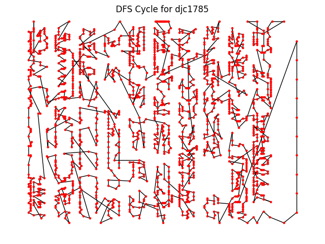
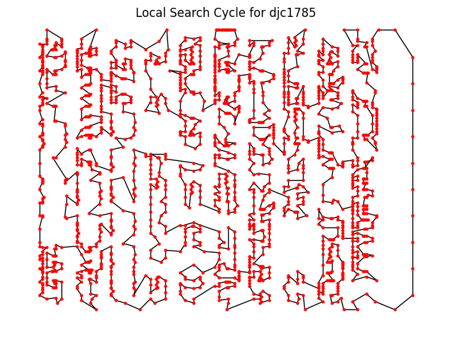

# Metaheuristic-Algorithms
## Introduction ##
Repository of metaheuristic algorithms aimed to solve a **Traveling Salesman Problem**. <br>
Part of the **Metaheuristic Algorithms** course I did in ***Wroclaw University of Science and Technology***, 2023/2024. <br><br>

| lab1 | Intro - DFS cycle based on MST |
|:----:|:-----|
| lab2 | Local Search  | 
| lab3 | Simulated Annealing, Tabu Search |
| lab4 | Genetic algorithm |

<br>

Data for computation is taken from  [this](https://www.math.uwaterloo.ca/tsp/vlsi/index.html) website.

---

## Prerequisites ##

- [CMake](https://cmake.org/)
- C++ 20
- Python
- fmt

----

## Build and Run ##

```Powershell
cd [lab_folder]
```


```Powershell
cmake -S . -B build && cmake --build build
```

```Powershell
./build/[lab_folder]
```

---

Each lab (besides lab4) includes a  **Python** script generating a graphical representation of a solution.


Sample:
<div align="center">
  
  <br><br>
  
</div>
